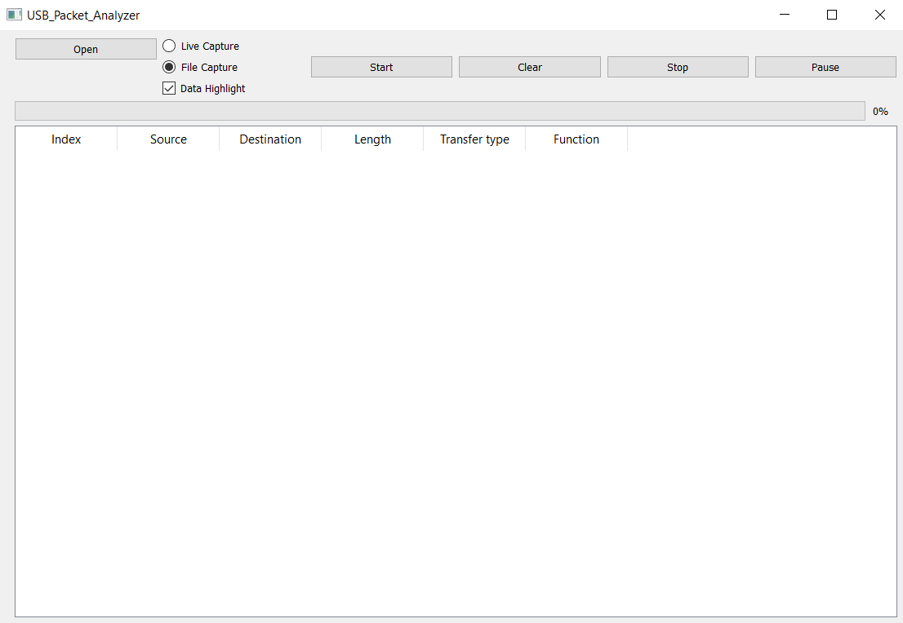
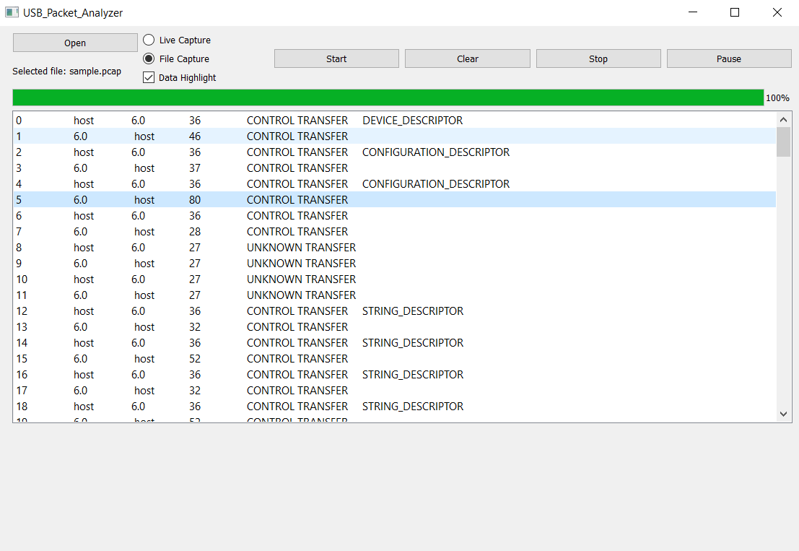

# USB_Packet_Analyzer
A simple C++ application for analyzing packets on USB bus.

## Table of contents
* [Introduction](#introduction)
* [Technologies](#technologies)
* [Setup](#setup)
* [Features](#features)
* [Illustrations](#illustrations)
* [Project status](#project status)
* [Sources](#sources)

## Introduction
App is used for analyzing and visualizing packets on USB bus. Program itself does not capture packets, but uses third-party application [USBPCAP](https://desowin.org/usbpcap/)
to obtain `.pcap` files. These files can then be interpreted after `USBPCAP` is done writing in those files. In application, this is marked as "offline" analysis. Application
also supports "live" capture when reading `.pcap` files generated by [Wireshark](https://www.wireshark.org/) by processing file while it is still beign written to.
So far application also supports semantic analysis of three basic HID devices: mouse, keyboard and joystick, and should be designed generally enough so it will be easy to add more
devices(**not** only `INTERRUPT_TRANSFER` specific).

## Technologies
* Compiled with ISO C++17 Standard
* Qt 5.15.0

## Setup
To run this project, you will need to download `Qt` version 5.15.0 or higher and then compile with `ISO C++17 Standard` or higher.

## Features
* Analyze packets on USB bus by interpreting `.pcap` files.
* Semantic analysis for some main HID devices like mouse, keyboard and joystick.
* HID Report descriptor parsing algorithm for easier adding semantic analysis of other HID devices
* Semantic analysis for all basic descriptors(e.g device,configuration,interface,endpoint)
* Optional data highlighting for easier navigation in packet hexdump.
### To Do:
* Adding semantic analysis for more HID devices.
* Adding semantic analysis for other than interrupt and control transfer.

## Ilustrations
Basic look of application at start: 

The view of packets after file selection: 

Closer look on separate packet: 

For easier navigation in hexdump, introducing colormap: 

Concrete example of semantic analysis of mouse interrupt transfer data sent to the host: 

## Project status
Project is currently still under development.

## Sources
Microsoft Corporation: Windows Driver Kit (WDK) on MSDN: https://docs.microsoft.com/en-us/windows-hardware/drivers/ddi/_usbref/
USB HID Usage Tables 1.21: https://www.usb.org/document-library/hid-usage-tables-121
USB Device Class Definition for HID 1.11: https://www.usb.org/document-library/device-class-definition-hid-111
